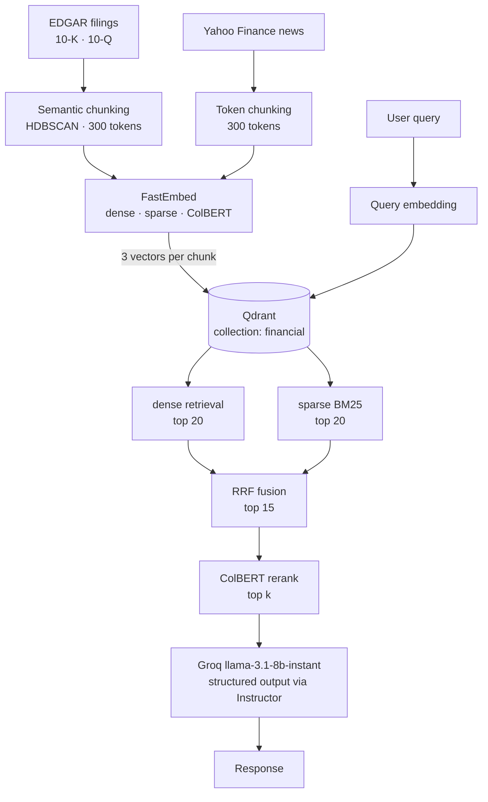
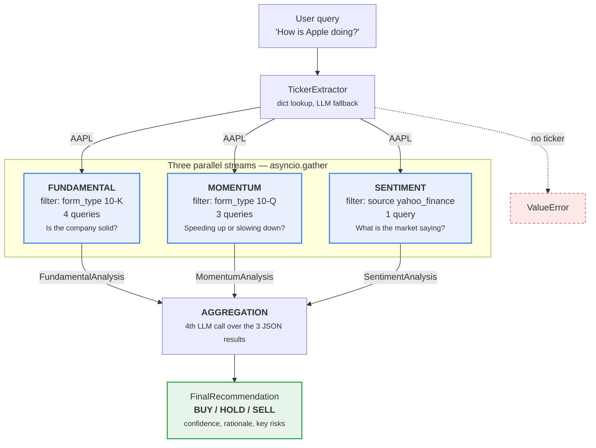
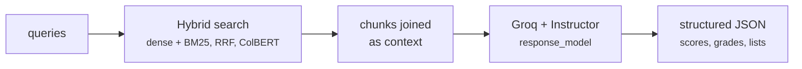

# FinLab
> Part of the curriculum for the [AI Engineering Specialization](https://deveficiente.com/oferta-20-especializacao-engenharia-ia) — Dev + Eficiente

A financial research assistant that combines SEC filings, news sentiment, and hybrid vector search to generate investment analysis using LLMs.

## How It Works

The system ingests data from two sources — EDGAR (SEC filings) and Yahoo Finance news — chunks and embeds them using a hybrid approach (dense + sparse + ColBERT), and stores everything in Qdrant. At query time, it retrieves the most relevant chunks and passes them to an LLM for analysis.



## Stack

- **Vector DB**: Qdrant (hybrid search with dense, sparse BM25, and ColBERT reranking)
- **Embeddings**: FastEmbed (`all-MiniLM-L6-v2`, `bm25`, `colbertv2.0`)
- **Chunking**: Semantic chunking via HDBSCAN clustering + token-aware splitting
- **LLM**: Groq (`llama-3.1-8b-instant`) via Instructor for structured outputs
- **API**: FastAPI
- **Observability**: Langfuse

## Project Structure

```
├── api/                  # FastAPI app
│   ├── routers/          # search, rag, agent endpoints
│   ├── services/         # search, rag, agent, embeddings logic
│   ├── models/           # Pydantic schemas
│   └── config/           # settings, prompts, company mappings
├── ingestion/            # Data ingestion scripts
│   ├── ingestion.py      # SEC filings (10-K, 10-Q)
│   ├── news_ingestion.py # Yahoo Finance news
│   ├── create-collection.py
│   ├── create_indexes.py
│   └── utils/            # edgar_client, news_client, chunkers
├── evaluations/          # Test suite (unit → integration → LLM-as-judge)
└── guardrails/           # Input validation demos
```

## Setup

**1. Install dependencies**
```bash
pip install uv
uv sync
```

**2. Configure environment**
```bash
cp .env.example .env
# Fill in: QDRANT_URL, QDRANT_API_KEY, GROQ_API_KEY
```

**3. Create the Qdrant collection and indexes**
```bash
python ingestion/create-collection.py
python ingestion/create_indexes.py
```

**4. Ingest data**
```bash
python ingestion/ingestion.py      # SEC filings (AAPL 10-K + 10-Q)
python ingestion/news_ingestion.py # Recent news from Yahoo Finance
```

**5. Start the API**
```bash
cd api && uvicorn main:app --reload
```

## API Endpoints

| Endpoint | Description |
|---|---|
| `POST /search` | Hybrid semantic search over financial documents |
| `POST /rag` | RAG: search + LLM answer |
| `POST /agent` | Full analysis: fundamental + momentum + sentiment + final recommendation |

### Example: Agent

```bash
curl -X POST http://localhost:8000/agent \
  -H "Content-Type: application/json" \
  -d '{"query": "How is Apple doing?", "limit": 3}'
```

The agent extracts the ticker (`AAPL`), runs three parallel analysis streams against the vector DB, and aggregates them into a structured `FinalRecommendation` (BUY / HOLD / SELL).



Each stream runs the same cycle — a filtered hybrid search, the retrieved chunks joined as context, and one LLM call constrained to a Pydantic `response_model`:



Separating the streams means the three verdicts can **disagree**, and the disagreement is itself signal — a strong 10-K paired with weak news reads very differently from both pointing the same way.

## Evaluation

```bash
# Unit tests (ticker extraction)
python evaluations/level-1-unit-tests.py

# Integration tests (full API)
python evaluations/level-2-integration-tests.py

# With Langfuse tracing
python evaluations/level-3-human-annonation.py

# LLM-as-judge scoring
python evaluations/level-4-llm-as-judge.py
```